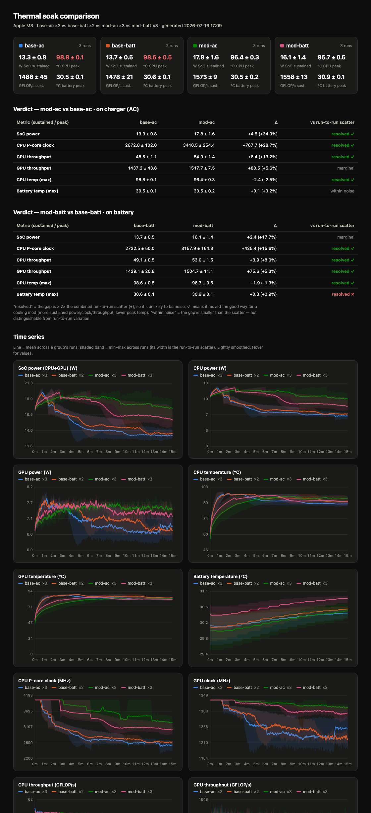

# thermal-bench

Sustained CPU + GPU soak test for measuring passive-cooling changes on this
MacBook Air (Apple M3). Drives the whole SoC to thermal steady state and logs
**power (W), temperature (°C), clock (MHz), and throughput (GFLOP/s)** over time,
so you can compare a baseline run against a modded run and see whether the mod
lets the chip sustain more power / performance and/or run cooler.

Everything is **sudoless** — telemetry comes from [`macmon`](https://github.com/vladkens/macmon).

## Results — cooling-shield mod on an M3 MacBook Air

The mod: **bridging the internal cooling shield to the bottom case** so the
aluminium bottom acts as a larger heat spreader. Measured with this tool —
3 runs per condition (2 for the on-battery baseline), 15-minute combined
CPU+GPU soaks, last-quarter = thermal steady state, `± =` run-to-run SD.

**Sustained (steady-state) performance:**

| Metric | Baseline | Modded | Change |
|---|---|---|---|
| **On charger** | | | |
| SoC power (CPU+GPU) | 13.3 ± 0.8 W | 17.8 ± 1.6 W | **+34 %** |
| CPU P-core clock | 2673 ± 102 MHz | 3440 ± 254 MHz | **+29 %** |
| CPU throughput | 48.5 ± 1.1 GFLOP/s | 54.9 ± 1.4 | +13 % |
| CPU peak temp | 98.8 ± 0.1 °C | 96.4 ± 0.3 °C | **−2.4 °C** |
| **On battery** | | | |
| SoC power (CPU+GPU) | 13.7 ± 0.5 W | 16.1 ± 1.4 W | **+18 %** |
| CPU P-core clock | 2732 ± 50 MHz | 3158 ± 164 MHz | **+16 %** |
| CPU throughput | 49.1 ± 0.5 GFLOP/s | 53.0 ± 1.5 | +8 % |
| CPU peak temp | 98.6 ± 0.5 °C | 96.7 ± 0.5 °C | **−1.9 °C** |

**The mod works:** the chip sustains substantially more power and a higher clock
while running *cooler* — the signature of improved dissipation. On charger the
gain reaches +34 % sustained power; on battery it's smaller (+18 %) because once
the thermal bottleneck is eased, the battery's power-delivery limit becomes the
new ceiling (the pack can't feed the SoC as hard as the adapter).

**Battery temperature — the thing to check before trusting a mod like this:**
+0.1 °C on charger, +0.3 °C on battery. The pack stays at ~31 °C under sustained
full load. The report flags the +0.3 °C as statistically "resolved" only because
run-to-run scatter is ±0.1 °C — it is **practically negligible** and nowhere near
any concern threshold. No adverse battery impact.

**Surface matters — realistic vs ideal (both modded, on charger):** the mod moves
heat into the bottom case, so how the bottom breathes changes the payoff. Re-tested
on a stand with no fabric underneath and slight elevation (still fully passive):

| Metric (sustained) | Modded on fabric | Modded on stand | Extra |
|---|---|---|---|
| SoC power | 17.8 ± 1.6 W | 18.9 ± 0.3 W | +6 % |
| CPU P-core clock | 3440 ± 254 MHz | 3531 ± 71 MHz | +3 % |
| CPU peak temp | 96.4 °C | 95.7 °C | −0.7 °C |

So the everyday fabric-surface numbers are a **floor**; giving the bottom case room
to breathe recovers a bit more. Stacking it up, on charger from stock to
mod-on-a-stand: **SoC power +42 %, sustained P-core clock +32 %, CPU throughput
+16 %, peak temp −3.1 °C** — all while the machine stays fully passive (no fans).
The tighter run-to-run scatter on the stand (±0.3 vs ±1.6 W) also suggests the
fabric was adding variability, not just lowering the mean.

### Test conditions (realistic, not optimal)

- MacBook Air M3 (8-core CPU / 8-core GPU, 16 GB), macOS 26.5, **Low Power Mode OFF**.
- On a wooden table, resting on a **fabric mousepad** — poor thermal contact for a
  bottom-case dissipation mod. This is a realistic everyday case, *not* the optimum;
  a bare hard surface or a stand would likely show a larger benefit.
- **Ambient wasn't held constant:** baseline runs at ~16–17 °C, modded runs the next
  day at ~20–21 °C. The modded set ran in a *warmer* room, which works *against* the
  mod — so the measured gains are, if anything, **understated**.



*(Generated by `report.py`. Raw run CSVs are kept local and are not committed.)*

## Why this measures the mod

On Apple Silicon the CPU and GPU share one die, so heat is shared. A passive Air
runs at full clock for a few minutes, then throttles as the die heats up. The mod
(bridging the cooling shield to the bottom case) should improve dissipation, which
shows up as **one or more of**:

- **Higher sustained power** — the SoC can hold a higher wattage before throttling.
- **Higher sustained throughput** — GFLOP/s stays up longer / settles higher.
- **Lower peak temperature** at the same power.
- **Throttling starts later** (clock stays at max for longer).

The report computes *peak* (first ¼ of the run, before heat builds) vs *sustained*
(last ¼, thermal steady state). The gap between them **is** the throttling.

## Usage

```bash
./bench.sh <label> [duration_s] [mode]
```

- `label` — run name, e.g. `baseline` or `modded` (required)
- `duration_s` — soak length, default `1200` (20 min)
- `mode` — `both` (default) · `cpu` · `gpu`

```bash
./bench.sh baseline          # single 20-min combined soak
python3 report.py            # build report.html from all runs in runs/
open report.html
```

### Campaigns (unattended, repeated runs)

For a real comparison you want **≥2 runs per condition** (3 is better). `campaign.sh`
runs N reps under one label back-to-back, cooling the machine to a consistent
thermal start (CPU ≤ 45 °C by default) before each rep:

```bash
./campaign.sh <label> [reps] [duration_s] [mode] [cooldown_C]
./campaign.sh base-ac 3 900          # 3 × 15-min runs, plugged in
```

All reps share the label (timestamps keep the CSVs distinct); `report.py` groups
them automatically. Start it and walk away.

### The 2×2 design (mod-state × power-source)

Power source must be held constant *within* a baseline↔modded comparison. Label
runs `<state>-<source>` and the report pairs them into one verdict per source:

```bash
# today (before the mod):
./campaign.sh base-ac   3 900        # plugged in   — Low Power Mode OFF
./campaign.sh base-batt 3 900        # on battery    — Low Power Mode OFF
# … perform the physical mod, then:
./campaign.sh mod-ac    3 900
./campaign.sh mod-batt  3 900
python3 report.py                    # 2 verdict tables: on charger, on battery
```

`report.py` recognises `base`/`stock`/`before` vs `mod`/`after` in the label and
the trailing `-ac` / `-batt` (or `-charger` / `-battery`) as the condition. You
can still scope it manually: `python3 report.py runs/*-batt-*.csv`.

> **Low Power Mode must be OFF** for every run — it's the one setting that changes
> throttling by power source and would confound the comparison. On Apple Silicon,
> CPU/GPU power limits are otherwise ~identical on battery vs charger, so the
> power-source axis mostly answers the **battery-temperature** question.

Each run writes `runs/<label>-<timestamp>.csv` (+ a `.meta.json`). `report.py`
**groups runs by label** — all `baseline` runs vs all `modded` runs — so run
each side **≥2 times** (3 is better). The report then shows each group as a mean
line with a min–max band (the band width = run-to-run scatter) and a **verdict
table** that flags whether the baseline→modded gap is bigger than that scatter:

- **resolved ✓** — gap ≥ 2× the combined run-to-run scatter and in the good
  direction (more sustained power/clock/throughput, or lower peak temp).
- **within noise** — gap smaller than the scatter; don't trust it.
- **resolved ✗** — a real change in the *bad* direction (e.g. hotter battery).

Power reported is **SoC compute power (CPU+GPU)** — the part the mod affects —
not total system watts. **Battery temperature** (from `ioreg`) is logged and
charted too, so you can catch the mod pushing heat toward the battery.

## Getting a fair comparison

A 20-30% difference is only trustworthy if the runs are otherwise identical:

1. **Same cool starting point.** Let the machine idle until the CPU is back near
   ambient (~35-40 °C) before each run. Back-to-back runs start hot and skew high.
2. **Same physical setup.** Same surface (a hard desk, not a lap or blanket), same
   orientation, lid open the same amount. Surface contact matters a lot for a
   bottom-case dissipation mod.
3. **Same power state.** Keep it plugged in (or on battery) consistently — power
   source changes the power limits.
4. **Quiet machine.** Close other apps; background work adds heat and noise.
5. **Similar ambient room temperature** between baseline and modded runs.
6. **Repeat.** Do 2-3 baselines and 2-3 modded runs; look for a consistent gap,
   not a single reading.

## Files

| File | What it is |
|------|------------|
| `bench.sh` | Entry point — builds `soakload`, runs a soak, logs a CSV. |
| `campaign.sh` | Runs N reps of one label unattended, cooling to a set temp between reps. |
| `src/soakload.swift` | Load generator: all-core FP work + a Metal GPU compute kernel, reports GFLOP/s. |
| `collect.py` | Merges `soakload` throughput + `macmon` telemetry → one CSV, prints a summary. |
| `report.py` | Builds `report.html` (self-contained, interactive) from the CSVs. |
| `runs/` | Per-run CSV + metadata. |

## Requirements

- Apple Silicon Mac, Xcode command-line tools (`swiftc`), Python 3.
- `macmon`: `brew install macmon` (already installed).

## Reading the numbers

- **`GFLOP/s` is a relative performance index, not a peak-FLOPS benchmark** — the
  loops are tuned to keep the units busy and to move with clock, so a drop means
  throttling. Compare it across *your own* runs, not against spec sheets.
- Expect CPU P-cores to sit at ~4056 MHz (max) early, then step down as it heats.
- macmon samples at 1 Hz; small second-to-second jitter in power/clock is normal —
  look at the trend and the sustained average.
